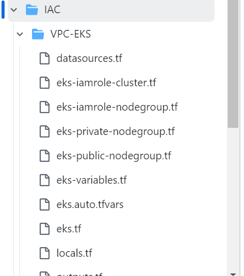
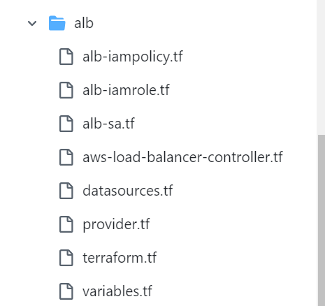
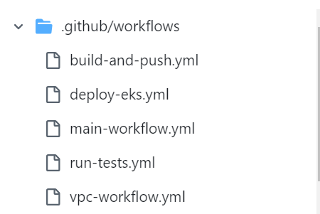

Deploying a Java application to AWS EKS Using GitHub Actions and IAC with Terraform

Introduction

In this project, we will deploy a simple Spring boot Hello, World application to EKS Cluster using Github Actions Workflows. EKS Cluster will be provisioned and managed using terraform, and the configuration will be handled through Github Action Workflows.

Pre-requisities

1. An AWS Account
2. S3 Bucket and DynamoDB table for terraform state file locking
3. Registration of the GitHub Actions identity provider (token.actions.githubusercontent.com) in AWS Identity Provider and assignment of a role to it
4. Ensure that the assigned role has the necessary permission to create VPC, EKS Cluster.

Terraform Infrastructure Setup

Terraform is used to provision the AWS infrastructure required for our application, managed by GitHub Action Workflows. Our setup includes VPC, EKS, and an ALB Ingress controller.

vpc-workflow.yml -> This workflow is triggered on a push to the main branch to provision the Terraform resources. It includes all stages of the Terraform workflow (Init, Validate, Plan, and Apply) in both jobs to ensure proper infrastructure provisioning.

Docker Image Build, Push, Run tests and Deployment

Three seperate workflows are created for these steps
build-and-push.yml -> For building and Pushing Docker Image
run-tests.yml -> Run Unit tests
deploy-eks.yml -> Deploying Helm charts to EKS Cluster

main-workflow.yml -> This GitHub Actions reusable workflow calls the three workflows above when there is a push event to the main branch. It only runs after the successful completion of the infrastructure provisioning workflow (vpc-workflow.yml).

We can use the Provisioned ALB DNS URL to access the application.

http://rakbanklb-1180256510.us-east-1.elb.amazonaws.com/

